# roger-skyline-1

## Summary
- [V.1 VM Part](#VMPart)
- [V.2 Network and Security Part](#NetworkSecurityPart)
	- [Install and configure `sudo`](#sudo)
	- [Configure a static IP on Virtual Machine](#StaticIP)
	- [Change the default port of the SSH service](#SSHDefault)
	- [Setup SSH Public Key Authentication](#SSHKeySetup)
	- [Set up Firewall with UFW (Uncomplicated Firewall)](#UFW)
	- [Set a DOS (Denial Of Service Attack) protection on open ports of VM(server) with `fail2ban`](#DOS)
	- [Set a protection against scans of open ports with `portsentry`](#StopScan)
	- [Stop services that are not needed](#StopServices)
	- [Update packages regularly](#UpdatePackages)
	- [Monitor changes of the `/etc/crontab` periodically](#UpdateCron)
		- [Set up local mail delivery with Postfix and Mutt](#SetUpMail)
- [V.2 Web Part](#WebPart)
- [V.3 Deployment Part](#DepPart)

## V.1 VM Part <a id="VMPart"></a>
***hypervisor:*** VirtualBox; ***Linux OS:*** Debian(64-bit); size of the hard disk is 8.00 GB(VDI, fixed size);
First, start VB, go to Setting->Network and set the Network Adapter to Bridged Adapter.
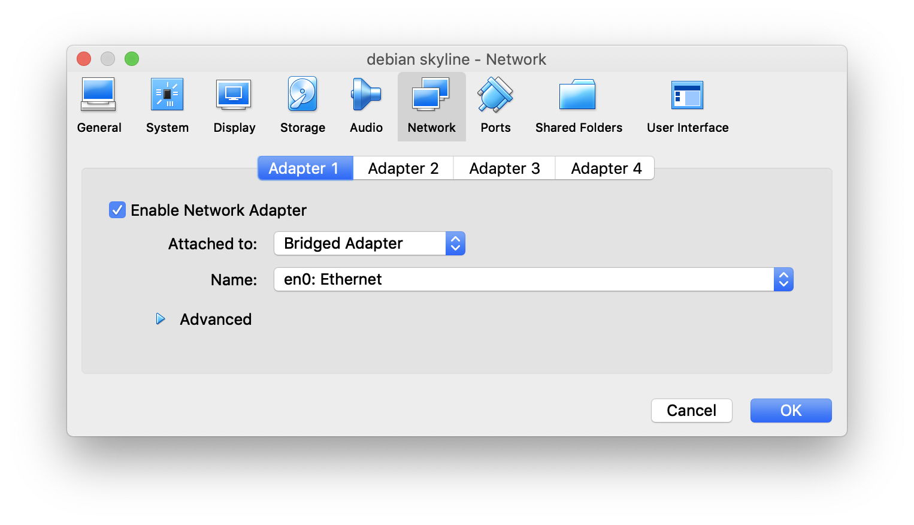

Next go to Settings->Storage and specify the image of the OS - I used `debian-10.2.0-amd64-netinst.iso`.

Make sure you have saved the VDI in `goinfre` so you don't run out of space.

Then you need to set up  Debian. The most important thing is to `Partition disks` correctly. Choose `Partition method` as `manual` and next choose:
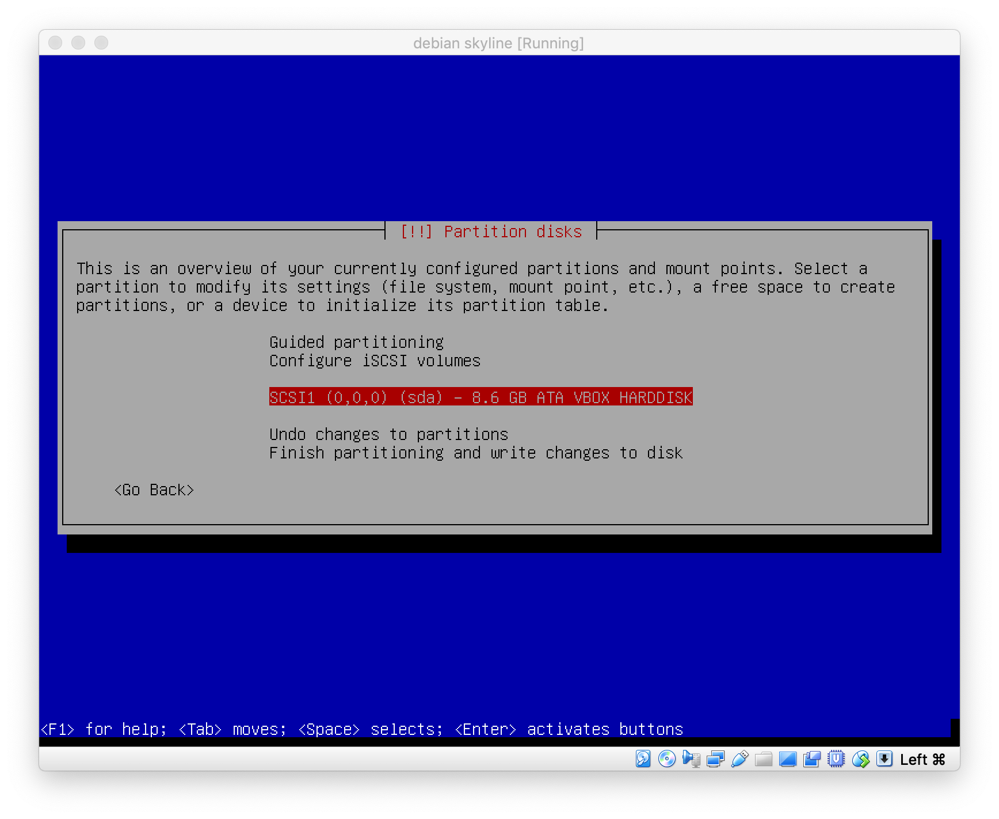

then:
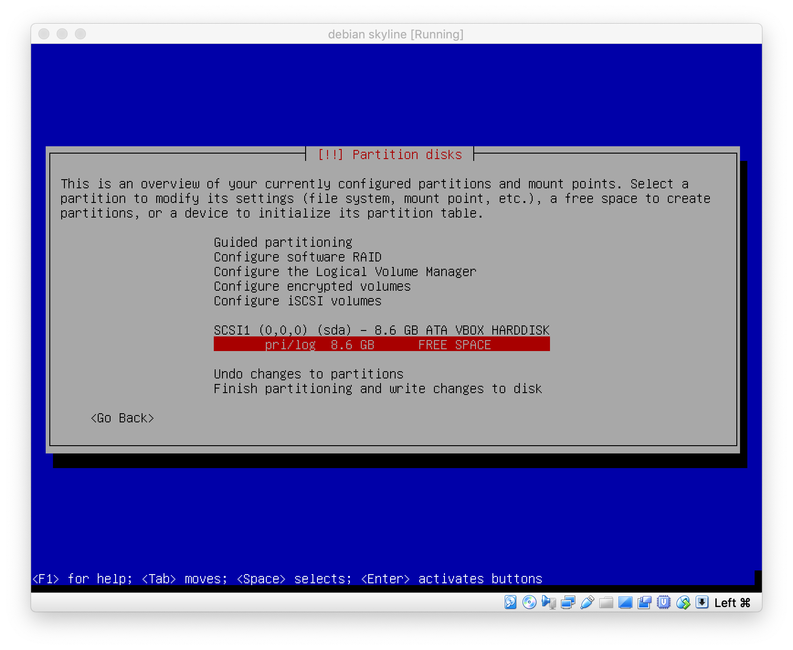

go for `Create a new partition` and specify new partition size:
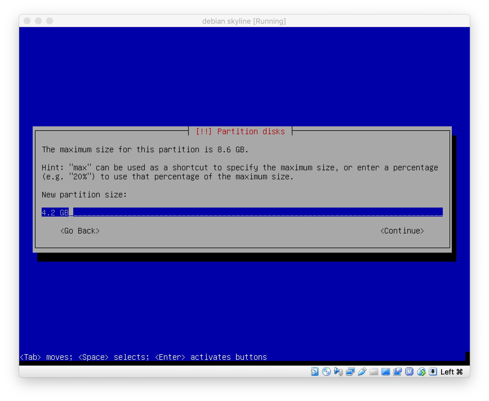

choose type and location (i choosed beggining); choose file system(i went for `/ - the root file system`):
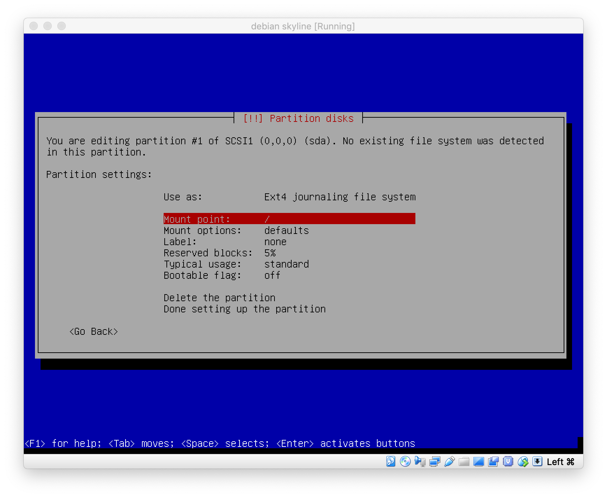

I created 3 partitions: one `primary` with mount point on the `/ (root)` of OS and with 4.2GB capacity, second `logical` with mount point on the `/home` dir and 3.4GB of space, and third `swap` with 988.8 MB of space:
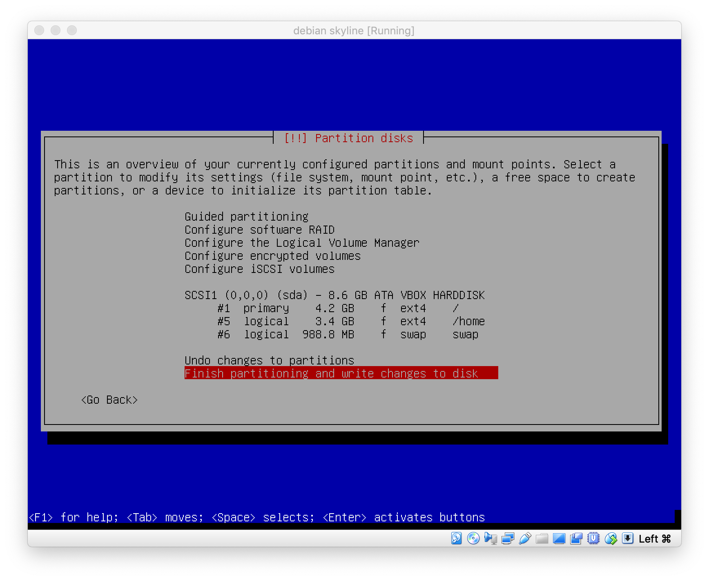

then go for `Finish partitioning and write changes to disk`.
Finally, I selected the defaults. No http proxy. I did not install desktop envirinment, only SSH server and standard system utilities.
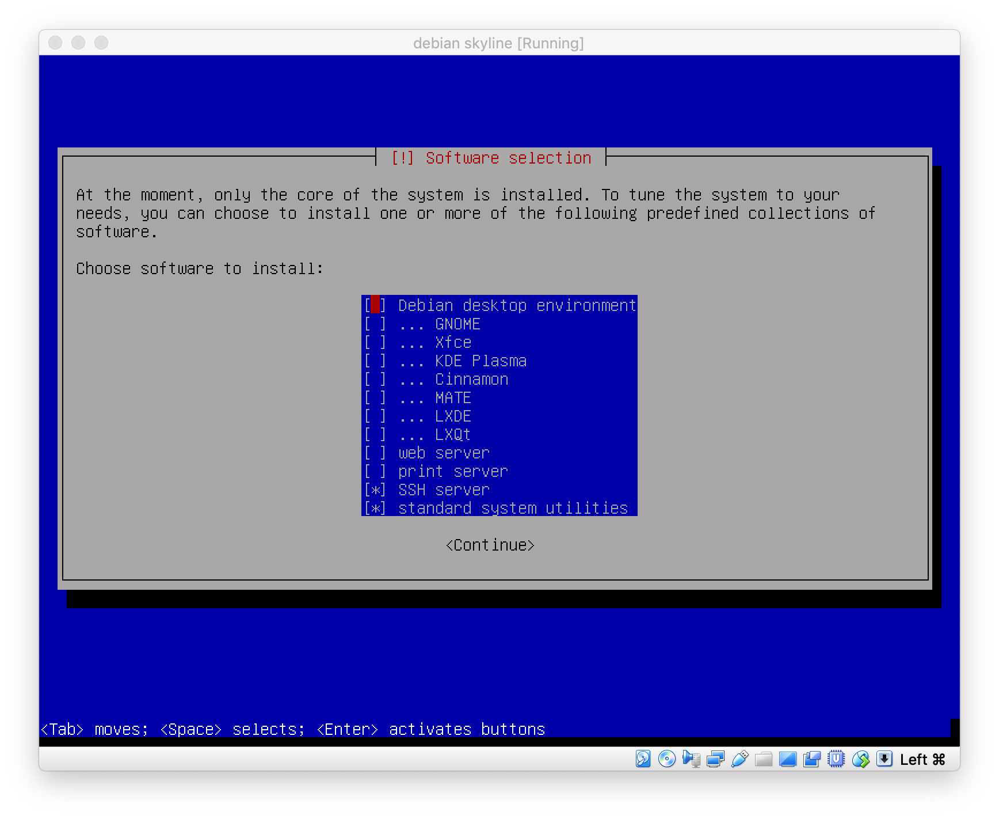

## V.2 Network and Security Part <a id="NetworkSecurityPart"></a>
### You must create a non-root user to connect to the machine and work.
Non-root login was created while setting up the OS. Just log in.
### Use sudo, with this user, to be able to perform operation requiring special rights. <a id="sudo"></a>
First, we need to install `sudo`, what we can do only as root, so:
```
$ su
$ apt-get update -y && apt-get upgrade -y
$ apt-get install sudo -y
```
exit root mode:
```
$ exit
```
but now, if we'll try to use `sudo`, the OS will respond: `kseniia is not in the sudoers file. This incident will be reported`. That means we need to open `/etc/sudoers` file as root. Don't forget to check rights on the file (must be writible!).
```
$ pwd
/etc
$ chmod +w sudoers
$ nano sudoers
```
add `username ALL=(ALL:ALL) ALL` to `# User privilege specification` section:

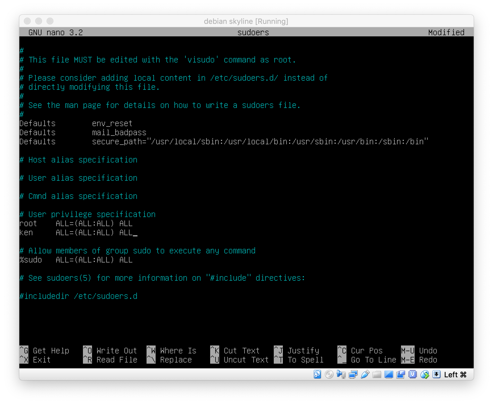

### We don’t want you to use the DHCP service of your machine. You’ve got to configure it to have a static IP and a Netmask in \30. <a id="StaticIP"></a>
Install `ifconfig`:
```
$ sudo apt-get install net-tools
$ sudo ifconfig
```
As we see, the name of our `bridged adapter` is ***enp0s3***. Let's setup ***static ip*** (not dynamic).

***1.*** We should modify `/etc/network/interfaces` network config file (don't forget to`$ sudo chmod +w interfaces`):

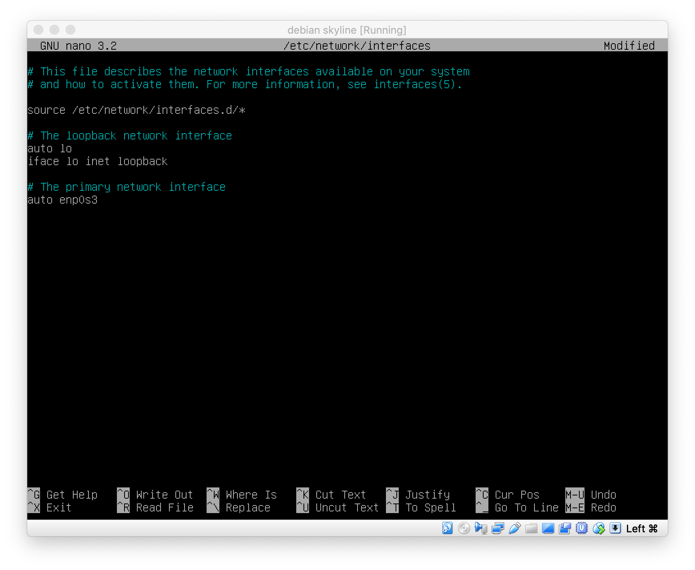

***2.*** Define your network interfaces separately within `/etc/network/interfaces.d/` directory. During the networking daemon initiation the `/etc/network/interfaces.d/` directory is searched for network interface configurations. Any found network configuration is included as part of the `/etc/network/interfaces`. So:
```
$ cd interfaces.d
$ sudo touch enp0s3
$ sudo vim enp0s3
```

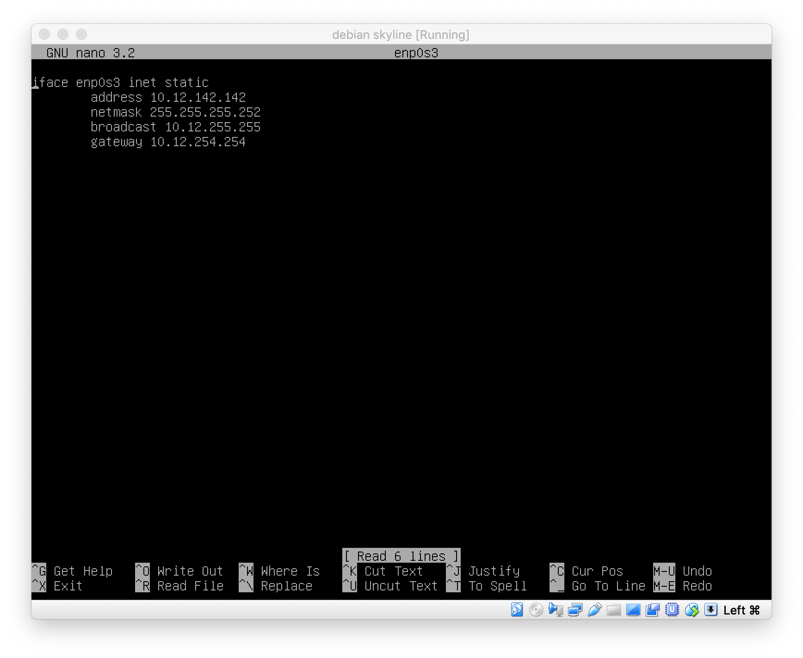

next restart the network service:
```
$ sudo service networking restart
```
run `ifconfig` to see the result:

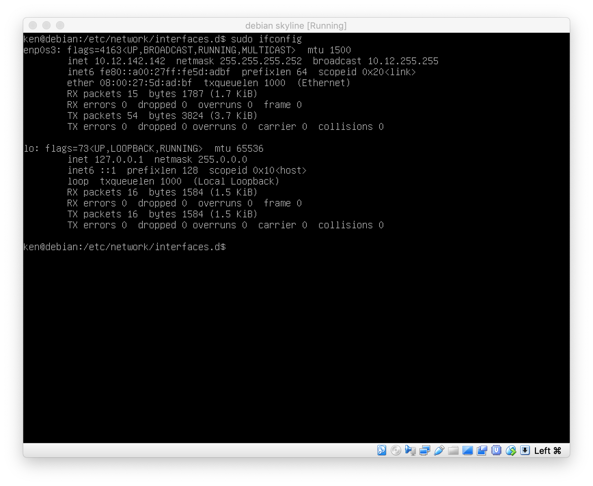

### You have to change the default port of the SSH service by the one of your choice. SSH access HAS TO be done with publickeys. SSH root access SHOULD NOT be allowed directly, but with a user who can be root. <a id="SSHDefault"></a>
let's check status of ssh server:
```
$ ps -ef | grep sshd
```
next we need to change `/etc/ssh/sshd_config`
```
$ sudo nano /etc/ssh/sshd_config
```
and change the line `# Port 22` - remove `#` and type choosen port number; you can use range of numbers from 49152 to 65535 (accordingly to IANA); I chose port number ***50000***; 
for now, set password authentication to "yes" and restart the sshd service:
```
$ sudo service sshd restart
```
login with ssh and check status of our connection:
```
$ sudo ssh ken@10.12.124.124 -p 50000
$ sudo systemctl status ssh
```
#### Finaly <a id="SSHKeySetup"></a>
let's test the ssh conection from host. We need to setup SSH public key authentication; OS of my host is macOS; run from ***your host's terminal***:
```
# host terminal

$ ssh-keygen -t rsa
$ cat ~/.ssh/id_rsa.pub
```
Copy the key
```
# host terminal

$ ssh [USERNAME.VM]@[IP.VM] -p [PORT.SSH.VM]
$ sudo mkdir .ssh
$ sudo nano .ssh/authorized_keys
```
 -> paste pub key 
replace password autentification in /etc/ssh/sshd_config to "no", set public key authentication to "yes", set permit root login to "no"


### You have to set the rules of your firewall on your server only with the services used outside the VM. <a id="UFW"></a>
I'll set up a Firewall with the help of ***UFW (Uncomplicated Firewall)***, whisch is an interface to ***iptables*** that is geared towards simplifying the process of configuring a firewall. 
```
$ sudo apt-get install ufw
$ sudo ufw status
$ sudo ufw enable
```
we can allow or deny by service name since ufw reads from `/etc/services`. To see get a list of services:
```
$ less /etc/services
```
let's allow services, that we need:
```
# allow ssh
$ sudo ufw allow 50000/tcp
# allow http
$ sudo ufw allow 80/tcp
# allow https
$ sudo ufw allow 443
```
now let's check status of our firewall:
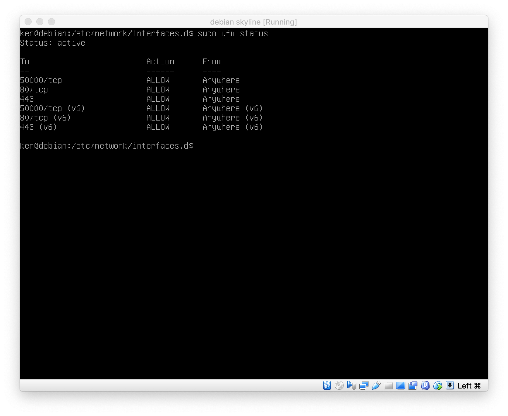


### You have to set a DOS (Denial Of Service Attack) protection on your open ports of your VM. <a id="DOS"></a>
Let's use `Fail2Ban`. We will install that and `iptables` and `apache2`:
```
$ sudo apt-get install iptables fail2ban apache2
```
Fail2Ban keeps its configuration files in `/etc/fail2ban` folder. The configuration file is `jail.conf` which is present in this directory. This file can be modified by package upgrades so we will keep a copy of it `jail.local` and edit it.
```
$ sudo cp /etc/fail2ban/jail.conf /etc/fail2ban/jail.local
$ sudo nano /etc/fail2ban/jail.local
```

1. SSH protocol security (protect open port 50000). Edit `/etc/fail2ban/jail.local`: 
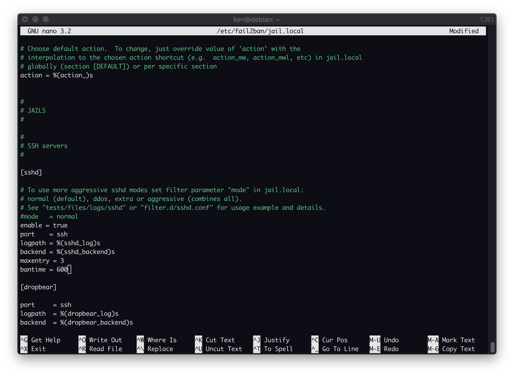

2. HTTP protocol security (protect our port 80). Edit `/etc/fail2ban/jail.local`:
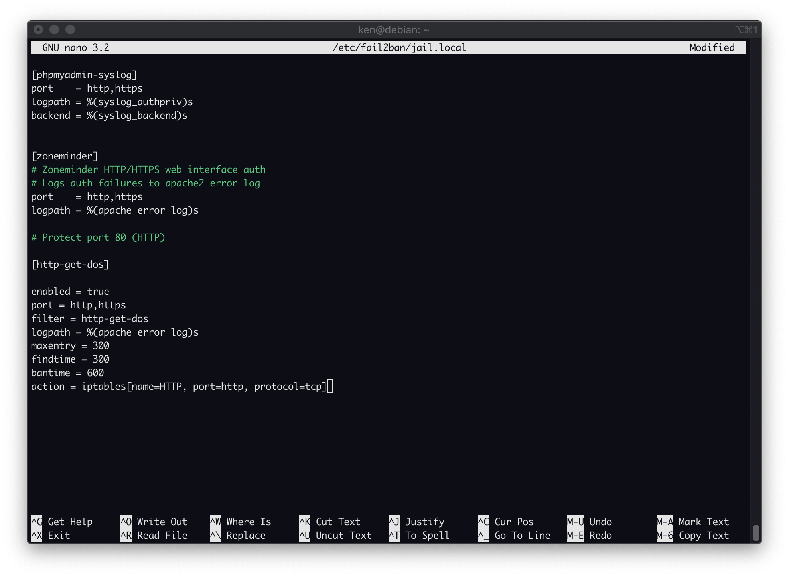

Now we need to create the filter, to do that, create the file `/etc/fail2ban/filter.d/http-get-dos.conf` and add this text:
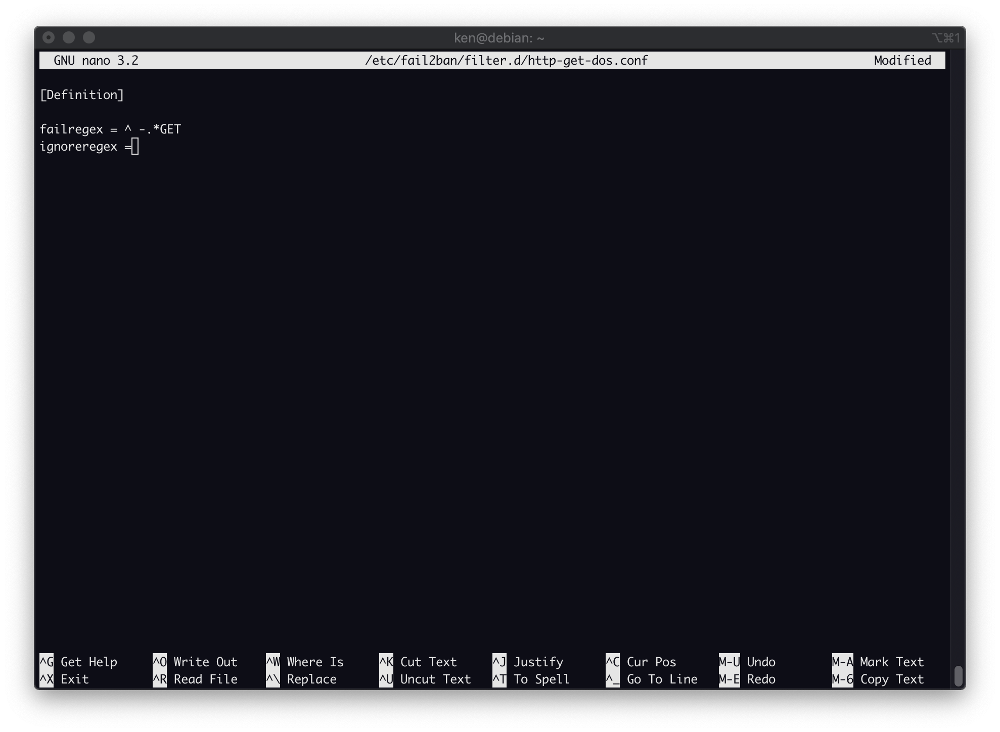

finally:
```
$ sudo ufw reload
$ sudo service fail2ban restart
```
let's see the result:

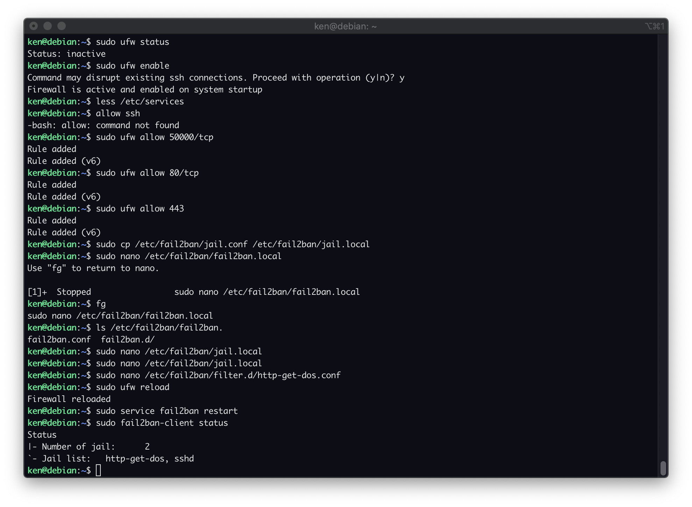

### You have to set a protection against scans on your VM’s open ports. <a id="StopScan"></a>

```
$ sudo apt-get install portsentry
```
modify the file `/etc/default/portsentry`:

```
TCP_MODE="atcp"
UDP_MODE="audp"
```
We also wish that `portsentry` is a blockage. We therefore need to activate it by passing BLOCK_UDP and BLOCK_TCP to 1; modify `/etc/portsentry/portsentry.conf`:
```
##################
# Ignore Options #
##################
# 0 = Do not block UDP/TCP scans.
# 1 = Block UDP/TCP scans.
# 2 = Run external command only (KILL_RUN_CMD)

BLOCK_UDP="1"
BLOCK_TCP="1"
```
We opt for a blocking of malicious persons through iptables. We will therefore comment on all lines of the configuration file that begin with KILL_ROUTE except this one:
```
KILL_ROUTE="/sbin/iptables -I INPUT -s $TARGET$ -j DROP"
```
verify your actions:
```
$ cat portsentry.conf | grep KILL_ROUTE | grep -v "#"
```
relaunch service `portsentry` and it will now begin to block the port scans:
```
$ sudo /etc/init.d/portsentry start
```
`portsentry` logs are in the `/var/log/syslog` file.

- [To protect against the scan of ports with portsentry](https://en-wiki.ikoula.com/en/To_protect_against_the_scan_of_ports_with_portsentry)
- [How to protect against port scanners?](https://unix.stackexchange.com/questions/345114/how-to-protect-against-port-scanners)

### Stop the services you don’t need for this project. <a id="StopServices"></a>
All the services are controlled with special shell scripts in `/etc/init.d`, so:
```
$ ls /etc/init.d
```
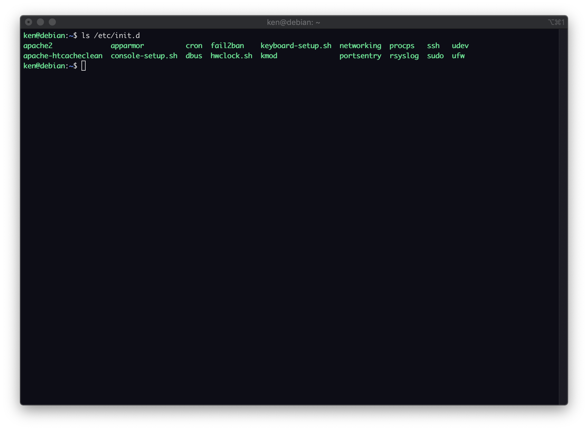

```
$ sudo systemctl disable bluetooth.service
$ sudo systemctl disable console-setup.service
$ sudo systemctl disable keyboard-setup.service
```
- [List of available services](https://unix.stackexchange.com/questions/108591/list-of-available-services)

### Create a script that updates all the sources of package, then your packages and which logs the whole in a file named /var/log/update_script.log. Create a scheduled task for this script once a week at 4AM and every time the machine reboots. <a id="UpdatePackages"></a>

```
$ touch update.sh
$ chmod a+x update.sh
```
```
#!/bin/bash
sudo apt-get update -y >> /var/log/update_script.log
sudo apt-get upgrade -y >> /var/log/update_script.log
```

```
$ sudo crontab -e
```

Add these line to `crontab`:
```
@reboot root sudo /home/ken/monitor_cron.sh
0 4 * * 1 root sudo /home/ken/monitor_cron.sh
```

### Make a script to monitor changes of the /etc/crontab file and sends an email to root if it has been modified. Create a scheduled script task every day at midnight.  <a id="UpdateCron"></a>

```
$ touch monitor_cron.sh
$ chmod a+x monitor_cron.sh
```
```
#!/bin/bash

sudo touch /home/ken/cron_md5
sudo chmod 777 /home/ken/cron_md5
m1="$(md5sum '/etc/crontab' | awk '{print $1}')"
m2="$(cat '/home/ken/cron_md5')"

if [ "$m1" != "$m2" ] ; then
	md5sum /etc/crontab | awk '{print $1}' > /home/ken/cron_md5
	echo "KO" | mail -s "Cronfile was changed" root@debian.lan
fi
```

Add this line to `crontab`:
```
* * * * * sudo root /home/ken/monitor_cron.sh 
```
#### to be able to use the mail command <a id="SetUpMail"></a>
install the `bsd-mailx package`:
```
$ sudo apt install bsd-mailx
```
Install `postfix` (setup happens after installation):
```
$ sudo apt install postfix
```
In postfix setup, select "Local only" to create a local mail server.
+ System mail name: "debian.lan"
+ Root and postmaster mail recipient: "root@localhost"
+ Other destinations to accept mail for: "debian.lan, debian.lan, localhost.lan, , localhost"
+ Force synchronous updates on mail queue? - No
+ Local networks: ENTER
+ Mailbox size limit (bytes): 0 (no limit)
+ Local address extension character: ENTER
+ Internet protocols to use: all

Edit `/etc/aliases`:
```
root: root
```
Then:
```
$ sudo newaliases
```
To update the aliases here.

Then change the home mailbox directory:
```
$ sudo postconf -e "home_mailbox = mail/"
```
Restart the postfix service:
```
$ sudo service postfix restart
```
Install the CLI (non-graphical) mail client `mutt`:
```
$ sudo apt install mutt
```
Create a config file `".muttrc"` for `mutt` in the `/root/` directory and edit it:
```
set mbox_type=Maildir
set folder="/root/mail"
set mask="!^\\.[^.]"
set mbox="/root/mail"
set record="+.Sent"
set postponed="+.Drafts"
set spoolfile="/root/mail"
```
Start `mutt` and exit:
```
$ mutt
Enter 'q' to exit
```
Test sending a simple mail to root:
```
$ echo "Text" | sudo mail -s "Subject" root@debian.lan
```
Then login as root and start `mutt`. The mail should now be visible.

## V.2 Web Part <a id="WebPart"></a>
My webpage is a notepad webapp I found online and modified a bit


> scp -P 50000 ken@10.12.124.124:/var/www/html/index.html
> scp -P 50000 ken@10.12.124.124:/var/www/html/app.js

Copy the rest of the files similarly

Generate SSL self-signed key and certificate:
```
$ sudo openssl req -x509 -nodes -days 365 -newkey rsa:2048 -keyout /etc/ssl/private/apache-selfsigned.key -out /etc/ssl/certs/apache-selfsigned.crt
Country name: UA
State or Province Name: ENTER
Locality Name: ENTER
Organization Name: ENTER
Organizational Unit Name: ENTER
Common Name: 10.12.124.124 (VM IP address)
Email Address: root@debian.lan
```

Create the file /etc/apache2/conf-available/ssl-params.conf and edit it:
```
SSLCipherSuite EECDH+AESGCM:EDH+AESGCM:AES256+EECDH:AES256+EDH
SSLProtocol All -SSLv2 -SSLv3
SSLHonorCipherOrder On

Header always set X-Frame-Options DENY
Header always set X-Content-Type-Options nosniff

SSLCompression off
SSLSessionTickets Off
SSLUseStapling on
SSLStaplingCache "shmcb:logs/stapling-cache(150000)"
```

Edit the file /etc/apache2/sites-available/default-ssl.conf so it looks like this:

```
<IfModule mod_ssl.c>
	<VirtualHost _default_:443>
		ServerAdmin root@localhost
		ServerName 10.12.124.124
		DocumentRoot /var/www/html
		ErrorLog ${APACHE_LOG_DIR}/error.log
		CustomLog ${APACHE_LOG_DIR}/access.log combined
		SSLEngine on
		SSLCertificateFile	/etc/ssl/certs/apache-selfsigned.crt
		SSLCertificateKeyFile /etc/ssl/private/apache-selfsigned.key
		<FilesMatch "\.(cgi|shtml|phtml|php)$">
				SSLOptions +StdEnvVars
		</FilesMatch>
		<Directory /usr/lib/cgi-bin>
				SSLOptions +StdEnvVars
		</Directory>
	</VirtualHost>
</IfModule>
```

Add a redirect rule to /etc/apache2/sites-available/000-default.conf, to redirect HTTP to HTTPS:
```
Redirect "/" "https://10.12.124.124/"
```

Enable everything changed and restart the Apache service:
```
$ sudo a2enmod ssl
$ sudo a2enmod headers
$ sudo a2ensite default-ssl
$ sudo a2enconf ssl-params
$ sudo apache2ctl configtest (to check that the syntax is OK)
$ sudo systemctl restart apache2
```

The SSL server is tested by entering "https://10.12.124.124" in a host browser. The expected result is a "Your connection is not private" warning page. Continue from this by selecting Advanced->Proceed to...
HTTP->HTTPS redirection is tested by entering "https://10.12.124.124" in the host browser.

## V.3 Deployment Part <a id="DepPart"></a>

The deployment script deploy.sh can be run after the prerequisites are met, which are:

1) A VM has been created using Virtualbox with the settings stated above.
2) The VM network is set to Bridged Adapter.
3) sudo has been set up for the user.
4) Git is installed on the VM ("$ apt-get install git" as root)
Clone the repository to the VM:

git clone https://github.com/kraskp/roger-skyline-1
Execute the deployment script (must be done with sudo):

$ chmod +x ./deploy.sh
$ sudo ./deploy.sh
Test that the deployment went fine by logging in to 10.12.124.124/index.html on the host machine browser.

To get a checksum of the VM disk, go to /home/admin/VirtualBox VMs/, select the VM and then run:

$ shasum < [vdi file]
